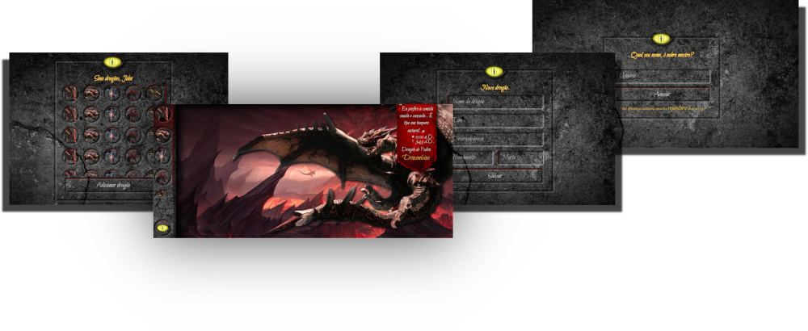

Frontend de **Librum ex Dracones**.

[url-dockerhub]: https://hub.docker.com/repository/docker/lambdadeveloper/sicredi
[url-circleci ]: https://app.circleci.com/pipelines/github/jmurowaniecki/sicredi-librum-ex-dracones
[url-climate  ]: https://codeclimate.com/github/jmurowaniecki/sicredi-librum-ex-dracones/maintainability

[![DockerHub][ico-dockerhub]][url-dockerhub]
[![CircleCI][ico-circleci]][url-circleci]
[![Maintainability][ico-climate]][url-climate]

## Executando o frontend

É possível executar apenas o frontend, para isso acesse a pasta `web` na raiz do projeto e execute os comandos `yarn install` para instalação das dependências e `yarn start` para inicializar a aplicação - que estará disponível em `http://localhost:4200`.

## Veja alguns screenshots

## Considerações

### Sobre o ambiente de desenvolvimento

Optei por utilizar o **docker-compose** devido a facilidade e rapidez em subir um ambiente com múltiplos builds com pouca necessidade de configuração/setup inicial.

As imagens base estão disponíveis no respectivo [Docker Hub][url-dockerhub].

Obtenha informações adicionais sobre o ambiente completo em [../README](../README.md).

### Processo de criação

Iniciei o desenvolvimento pelo frontend utilizando **Angular 9** e **SCSS** partindo logo a seguir para os fluxos de entrega. A seguir desenvolverei a integração com o **backend** e a **API** solicitada.

#### // Hic svnt dracones

Este exemplo utiliza as bibliotecas [pizzicato de alemangui](https://github.com/alemangui/pizzicato) para as músicas de fundo e demais efeitos sonoros. Músicas e efeitos sonoros obtidos através de [FreeSound.org](https://freesound.org/) licenciados em sua maioria como Creative Commons ou uso particular.

As imagens foram extraídas de [PNG find](https://www.pngfind.com/) em sua maioria como licença Creative Commons ou uso particular, e foram em parte reconstituídas e modificadas artisticamente para se adequar ao design preservando a arte original.

Inspiração no trabalho artístico de Diablo - UI e OST -, Rhapsody of Fire e **D&D / d⚂20**.

Nenhum plugin foi utilizado para os efeitos de paralax nos dragões - _nenhum dragão foi ferido fora dos tabuleiros_.

_**Labor improbus omnia vincit** - Publius Vergilius Maro._

[ico-dockerhub]: https://img.shields.io/badge/λ::dev-sicredi-099cec?style=flat-square&logo=docker&logoColor=fff
[ico-circleci ]: https://img.shields.io/circleci/build/github/jmurowaniecki/sicredi-librum-ex-dracones?label=CircleCI&logo=circleci&style=flat-square&token=b9fd25eb908755fd60791b8b3bee30e4641ac9e7
[ico-climate  ]: https://api.codeclimate.com/v1/badges/f1c59a28eaeacc36c2b1/maintainability
